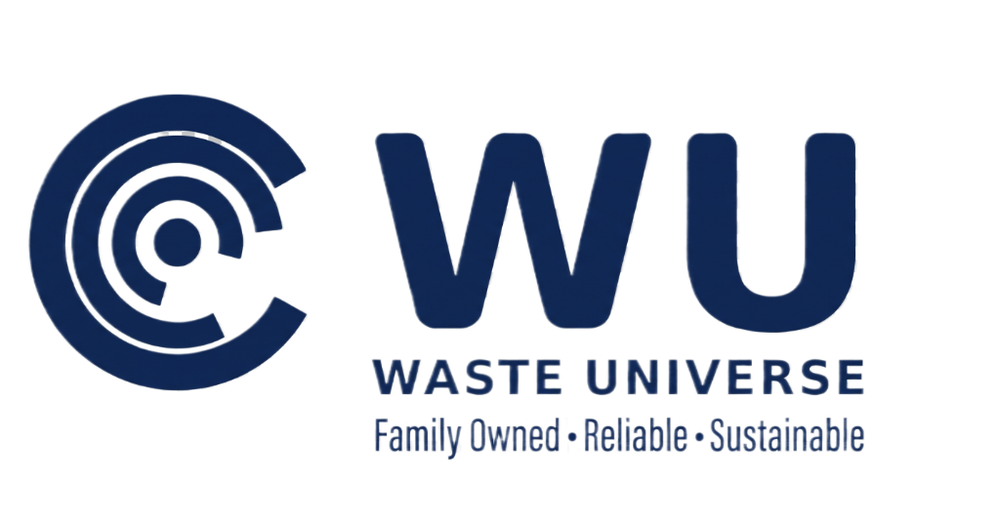

<div align="center">
  
  <br/><br/>
  
  <h3><strong>Modern, Premium Waste Management Platform</strong></h3>
  
  <p>
    A high-performance, dynamic frontend landing page built for a local waste management and dumpster rental company. Designed with a focus on modern UI/UX principles, psychological conversion triggers, and ultra-smooth animations.
  </p>

</div>

<br/>

## 🌟 Overview

**Waste Universe** is a family-owned waste management service covering Massachusetts and Rhode Island. This project represents a complete digital overhaul to elevate their brand from a standard local utility to a premium, trustworthy, and modern service provider.

The goal of this project was to build a highly responsive, performant, and visually stunning web experience without relying on heavy frontend frameworks—using pure HTML5, CSS3, and Vanilla JavaScript.

## 🚀 Key Features

- **Modern Glassmorphism Design**: Utilizes CSS `backdrop-filter`, `radial-gradient` masks, and transparent layers to create a silky, premium aesthetic that steps away from traditional "blocky" layouts.
- **Dynamic Review Rotator**: A custom-built JavaScript carousel that auto-scrolls through live customer feedback, mimicking a real-time data feed to build instant social proof.
- **Interactive UI with Micro-Animations**: Features smooth CSS transitions, subtle hover states, and a unique split-flap rolling number animation for the service statistics.
- **Web Audio API Integration**: Includes subtle, subliminal sound design on interactive elements (like the split-flap counters) to enhance tactile feedback and psychological engagement.
- **Performance Optimized**: 
  - Lazy loading for all heavy image assets.
  - Preconnected fonts and optimized critical CSS.
  - Zero heavy external JS dependencies.
- **Responsive Architecture**: Fully fluid and adaptive layout that looks flawless on both ultra-wide desktops and mobile devices.
- **SEO & Analytics Ready**: Configured with Open Graph meta tags, Twitter Cards, and Google Analytics (GTAG) integration.

## 🛠️ Tech Stack

- **HTML5**: Semantic, accessible markup.
- **CSS3**: Custom properties (variables), Flexbox/Grid layouts, animations, and advanced masking. No Tailwind or Bootstrap—100% custom styling.
- **Vanilla JavaScript**: DOM manipulation, Intersection Observers for scroll animations, and dynamic component rendering.

## 🎨 Design Philosophy & Branding

- **Color Palette**: 
  - **Navy Blue (`#101E4A`)**: A deep, rich primary brand color conveying trust, authority, and professionalism.
  - **Gold (`#FFFFFF` to Gold Accents)**: Used for highlights, review stars, and call-to-action elements to create a premium feel.
  - **Silky White Texture**: The background utilizes a custom, subtle `radial-gradient` noise texture to avoid the starkness of pure flat white pixels, giving the site a "luxurious" depth.

## 💻 Running Locally

Since this project requires no build tools or package managers, running it is incredibly simple:

1. Clone the repository:
   ```bash
   git clone https://github.com/yourusername/waste-universe.git
   ```
2. Navigate to the project directory:
   ```bash
   cd waste-universe
   ```
3. Open `index.html` in your favorite browser, or serve it using a local server extension (like Live Server in VSCode).

## 👨‍💻 About the Developer

I am a Frontend Developer passionate about building beautiful, high-converting, and performant web interfaces. This project showcases my ability to blend technical execution with UI/UX design psychology.

---
*Built with passion for the web.*
